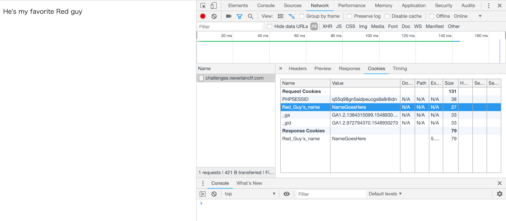
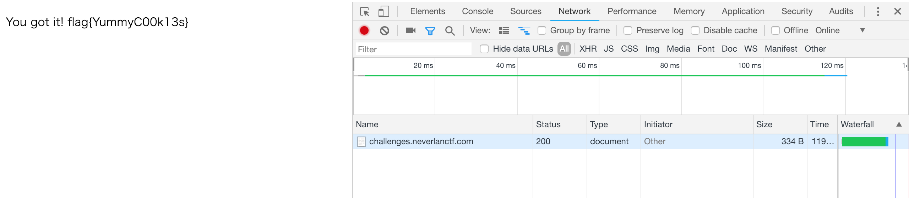
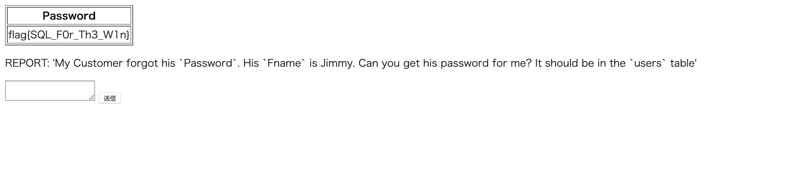
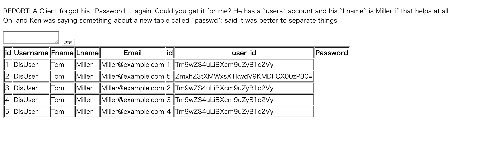
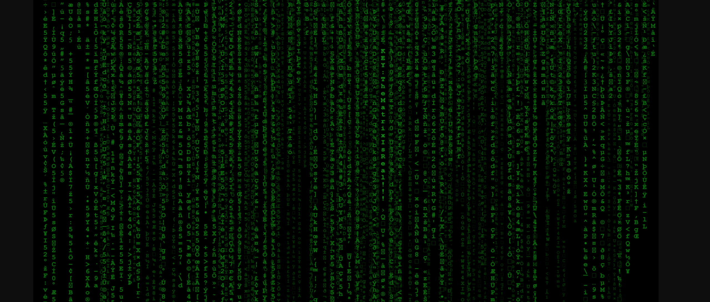

# 総評
やはり中学生向けCTFということで全体的に難易度は低めでした。おかげで普段のCTFより多くの問題を解くことが出来ました。ただし、ところどころポイントが低いものが取れていなかったりするので、まだまだ知識不足は否めないと感じました。今回はWebが比較的得意なメンバー1人のみの参加となったので、解けているジャンルに偏りがあります。ただ他のジャンルも初歩的な内容を扱っているはずなので、これくらいは解けないといけないと思います。他のwriteupを参考に他のジャンルの知識も増やしていきたいです。

以下writeupになります。

---

# ジャンル名
## 問題名
### Description(問題の説明)
### Solution(回答)

の順で表記しています。

---

# Crypto
## Cover the BASEs
### Description
  ZmxhZ3tEMWRfeTB1X2QwX3RoM19QcjNfQ1RGfQ==
### Solution
  説明文をそのままBase64でデコードします。  
  `flag{D1d_y0u_d0_th3_Pr3_CTF}`

## Super Old School
### Description
  This image is trying to tell you something.
### Solution
  
  古代の数字の数え方の一つなのかなと思い、左側のブーメランみたいなものを十の位、右側のピンみたいなものを1の位として数えてみる。
  すると、
  `22 12 21 14 1 12 1 7 9 19 19 15 13 1 14 25 3 18 25 16 22 15 19`  
  1→a,2→bと仮定して置き換えると、
  `VLUN FLAG IS SO MANY CRYPVOS`  
  flag{SO MANY CRYPVOS}と思い入力するもfailed。  
  `flag{SO MANY CRYPTOS}`としたところsuccess。  
  解けたもののなぜV→Tなのか分かりませんでした。  
  他の方のwriteupをぜひ見たい。

---
# Web
## Cookie Monster
### Description
  It's a classic
### Solution
    
  まずは題名にCookieと書かれているので検証からCookieを確認してみる。すると、  
  `Name:Red_Guy's_name, Value:NamesGoesHere`  
  とあるので、Valueを`Elmo`に変更してフラグ取得。  
  問題にあるCookie Monsterといえばセサミストリート。セサミストリートの赤いやつと言えば、、、エルモ！  
  
  `flag{YummyC00k13s}`
## React To This
### Description
  It looks like someone set up their react site wrong...
### Solution
  Reactの知識が無いのでとりあえず、検証を使いsourceを片っ端から見ていく。  
  それで分からなかったリファレンスを見ようと思った矢先  
  
  見つけてしまった。  
  `flag{s3cur3_y0ur_s3ss10ns}`
## Things are not always what they seem
### Description
  if you can't find it you're not looking hard enough
### Solution
  問題のサイトのソースコードを表示すると隠れた文字を見ることができます。
  `flag{Whale_w0u1d_y0u_l00k3y_th3r3}`

## SQL Fun 1
### Description
  REPORT: 'My Customer forgot his Password. His Fname is Jimmy. Can you get his password for me? It should be in the users table'
### Solution
  説明文に、パスワードを見つけるための情報が書いてあるのでそのままSQL文を書いてみました。  
  `SELECT Password FROM users WHERE Fname = "Jimmy"`  
  すると、  
  
  `flag{SQL_F0r_Th3_W1n}`

## SQL fun 2
### Description
  REPORT: A Client forgot his Password... again. Could you get it for me? He has a users account and his Lname is Miller if that helps at all. Oh! and Ken was saying something about a new table called passwd; said it was better to separate things
### Solution
  こちらもSQL fun 1と同じく説明文の情報をSQLに起こしてみる。
  `SELECT * FROM users JOIN passwd WHERE Lname = 'Miller';`
  すると、  
  
  と表示される。
  2行目のuser_idカラムの値のみBase64ではないかと思ったので、デコード。  
  `flag{W1ll_Y0u_J01N_M3?}`

## Das Blog
### Description
  Word on the street, Johnny's got a blog. Seems he doesn't know how to escape his inputs.
### Solution
  トップページからログインページに移動します。  
  まずは適当にadmin/adminと打ってみます。
    
  次に'(シングルクオーテーション)のみをUsernameに打ってみます。
  
  出力が変わったのでエスケープ処理がされていないことがわかります。(そういえば説明文に記載されてましたね)  
   `Username: ' or 1=1--`
   と入力し、ログインするとリンクが表示されるのでクリック。  
   `flag{3sc4pe_Y0ur_1npu7s}`

---
# Recon
## purvesta
### Description
  I love Github. Use it all the time! Just wish they could host a webpage...
### Solution
  初めに問題名の意味を調べたところ、今大会の主催の方を意味しているということが分かった。  
  早速purvestaさんのGihubに行き最近更新されたリポジトリがないか調べると、purvesta.github.ioが更新されている。  
  見に行くと、lolというファイルがあるので中身を見ると、  
  `flag{Th1s_g1thub_l00ks_a_l1l_sparc3}`
## Let's go way back
### Description
  Back in the day, Zesty hid a flag in the first version of our website.
### Solution
  [Internet Archive: Wayback Machine - Internet Archive: Wayback Machine](https://archive.org/web/)  
  上記のサイトを使用することで、過去にあったwebサイトにもう一度訪れること可能になります。  
  `https://neverlanctf.com`  
  と入力し、一番古いスナップショットを選択します。
    
  なんと無く後ろのマトリックスっぽいやつが怪しいな、、、ということで検証を使用してみてみます。
  
  一箇所だけ光っている怪しい文字が、、、！  
  `KEY:TheMatrixIsReal`  
  ということで、  
  `flag{TheMatrixIsReal}`

---
# Trivia
## SQL Trivia 1
### Description
  The oldest SQL Injection Vulnerability. The flag is the vulnerability ID.
### Solution
  Triviaは知識を問うジャンルなので、ひたすらGoogleで検索しました。  
  問題を読み取ると、最も古いSQLインジェクションの脆弱性のIDを探しそれがフラグになるとのこと。  
  こちらのサイトを使用して検索しました。  
  [CVE Details - https://www.cvedetails.com/](https://www.cvedetails.com/)  
  `flag{CVE-2000-1233}`
## SQL Trivia 2
### Description
  In MSSQL Injection Whats the query to see what version it is?
### Solution
  問題を読み取ると、MSSQLインジェクションではデータベースのバージョンを見るクエリはどのように書くか？とあります。  
  こちらもGoogleで検索します。  
  [MSSQL Injection Cheet Sheet | pentestmonkey](http://pentestmonkey.net/cheat-sheet/sql-injection/mssql-sql-injection-cheat-sheet)  
  こちらのサイトにバージョンを見つけるクエリが書いてあったのでそれをフラグ形式にします。  
  `flag{SELECT @@version}`
## Sea Quail
### Description
  A domain-specific language used in programming and designed for managing data held in a relational database management system, or for stream processing in a relational data stream management system.
### Solution
  Google翻訳すると、  
  「プログラミングで使用され、リレーショナルデータベース管理システムで保持されているデータを管理するため、またはリレーショナルデータストリーム管理システムでストリーム処理するために設計されたドメイン固有の言語」  
  ん？SQLのこと？だと思ったのでそのままフラグ形式に。  
  `flag{SQL}`  
## 64 Characters
### Description
  A group of similar binary-to-text encoding schemes that represent binary data in an ASCII string format by translating it into a radix-64 representation.
### Solution
  同じように翻訳すると、  
  「バイナリデータを基数64表現に変換してASCII文字列形式で表現する、類似のバイナリ - テキストエンコーディング方式のグループ」
  Base64のこと？だと思ったのでそのままフラグ形式に。  
  `flag{Base64}`
## With Some Milk
### Description
  A small piece of data sent from a website and stored on the user's computer by the user's web browser while the user is browsing.
### Solution
  問題名からなんとなく察せるが、一応翻訳。  
  「ユーザーがブラウズしている間に、Webサイトから送信され、ユーザーのWebブラウザによってユーザーのコンピュータに保存される小さなデータ」  
  `flag{cookie}`
## Beep Boop
### Description
  A standard used by websites to communicate with web crawlers and other web robots. The standard specifies how to inform the web robot about which areas of the website should not be processed or scanned
### Solution
  翻訳  
  「Webクローラーや他のWebロボットと通信するためにWebサイトで使用される標準。 この規格では、Webロボットのどの領域を処理またはスキャンしないようにするかをWebロボットに通知する方法を指定しています」  
  robots.txtのことかな？そのままフラグ形式に。
  `flag{robots.txt}`
